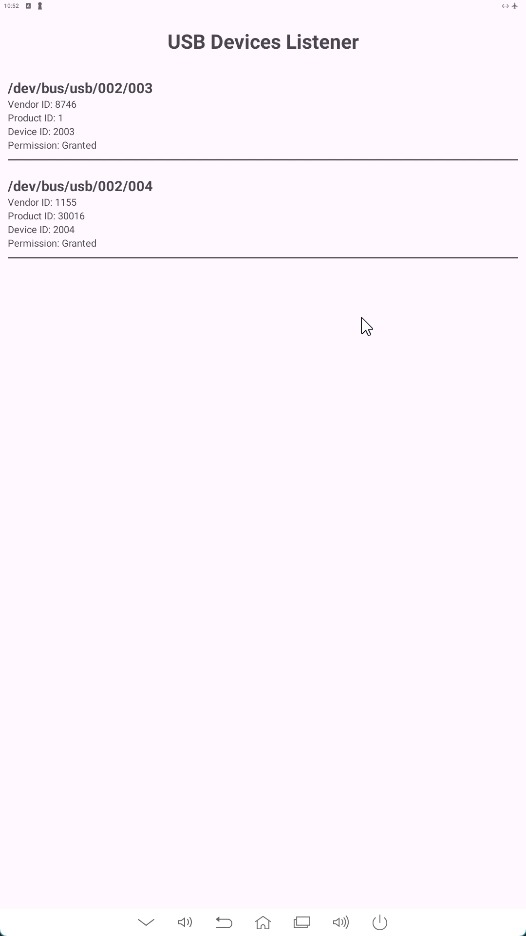
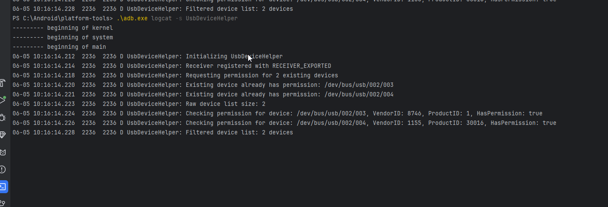

# AndroidUSBConnectionListener
Android cihazlaran baglanan USB cihazlarinin PCI ve VENDOR ID lerini ekranda livedata olarak dinler. Gerekli izinleri var mi yok mu kontrol eder. 

Ayni zamanda USB cihazlarinin baglanma ve ayrilma olaylarini dinler.

Asagidaki komut ilede Windows dan dinleme yapilabilir

# Ekran Görüntüsü

# Dikkat

device_filter.xml  dosyasinda hangi USB cihazlarinin dinlenecegi tanimlanir. Yani bir cesit Whitelist gibidir. Bu dosyayi kendinize gore duzenleyebilirsiniz.

UsbDeviceHelper sinifini kullanarak USB cihazlarinin baglanma ve ayrilma olaylarini dinleyebilirsiniz.

Her defasinda tekrar tekrar izin istememesi icin uygulama izinlerini AndroidManifest.xml dosyasina eklemeyi unutmayin. Ayrica Helpder dosyasindaki allowedDevices listine Pair olarak vendor ve pci id yi ekleyebilir siniz

